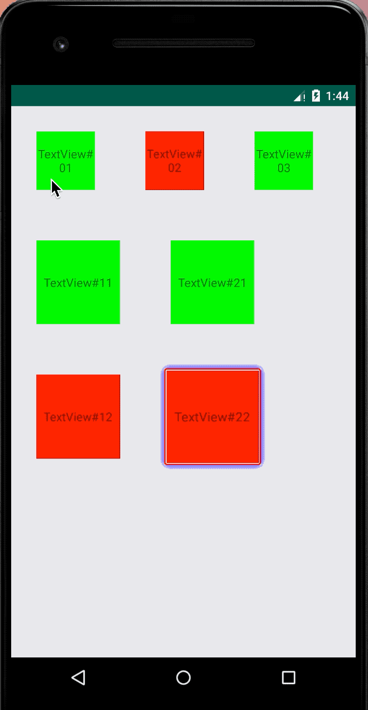

# AutoFocusFrameLayout

统一的焦点显示框架：

1、对框架中的控件应用统一的焦点效果，而不用去重复指定selector资源

2、可以自定义动画形式焦点效果（selector做不到）

效果如图：





 
## 使用方法：

```xml
<com.monkeyliu.smartfocus.AutoFocusFrameLayout
            android:layout_width="match_parent"
            android:layout_height="wrap_content">
            
            <!-- 你的布局，其中focusable的view会具有统一的UI效果~ -->
            
</com.monkeyliu.smartfocus.AutoFocusFrameLayout>
```

**注意**

1、如果你的布局中用到了`RecyclerView`，请使用`com.monkeyliu.smartfocus.FocusRecyclerView`代替.

2、获取焦点的View会进行放大(1.1倍)，有可能会被父布局裁减掉，可能需要在你的布局结构中调试添加 `android:clipChildren="false"` 和
`android:clipToPadding="false"`属性来保证不被裁剪

## 配置焦点效果
框架中定义了两种类型的FocusUI: `ColorFocusBorder`和`DrawableFocusBorder`，
可以通过它们的Builder来指定你想要的焦点效果。

*ColorFocusBorder*
```java
AbsFocusBorder.Builder focusBorderBuilder = new ColorFocusBorder.Builder(getContext())
                .borderWidth(2) //border宽度
                .borderColor(Color.RED) //border颜色
                .borderRadius(6) //border圆角半径
                .shadowWidth(20) //shadow半径
                .shadowColor(Color.BLUE) //shadow颜色
                .padding(3) //内边距
                .scaleX(1.1f) //X方向缩放倍数
                .scaleY(1.1f) //Y方向缩放倍数
                .enableShimmer(); //使用闪光特效
```

或者*DrawableFocusBorder*
```java
AbsFocusBorder.Builder focusBorderBuilder = new DrawableFocusBorder.Builder(getContext())
                .borderDrawableRes(R.drawable.icon_focus); //焦点图片
```
将builder设置给AutoFocusFrameLayout即可完成焦点效果配置。
```java
AutoFocusFrameLayout autoFocusFrameLayout = findViewById(R.id.focus_framelayout);
autoFocusFrameLayout.setFocusBorderBuilder(focusBorderBuilder);
```

## 更多支持
1、对于某些View，不想使用统一的焦点效果，而想使用自己定义的selector中的效果：

给View添加 `android:tag="ignore_focus"` 即可，例如
```xml
<Button
        android:layout_width="wrap_content"
        android:layout_height="wrap_content"
        android:tag="ignore_focus"
        android:text="不使用统一焦点效果"/>
```


2、对于某些Focusable的View，想针对其某个子View应用焦点效果:

给相应的子View添加 `android:tag="focus"` 即可，例如
```xml
<LinearLayout xmlns:android="http://schemas.android.com/apk/res/android"
    android:layout_width="wrap_content"
    android:layout_height="wrap_content"
    android:focusable="true"
    android:orientation="vertical">

    <ImageView
        android:id="@+id/item_imageview"
        android:layout_width="150dp"
        android:layout_height="208dp"
        android:tag="focus"
        android:scaleType="fitXY" />

    <TextView
        android:id="@+id/item_title"
        android:layout_width="wrap_content"
        android:layout_height="wrap_content" />

</LinearLayout>
```
这样虽然LinearLayout获取到焦点，但是焦点效果是应用在ImageView上.